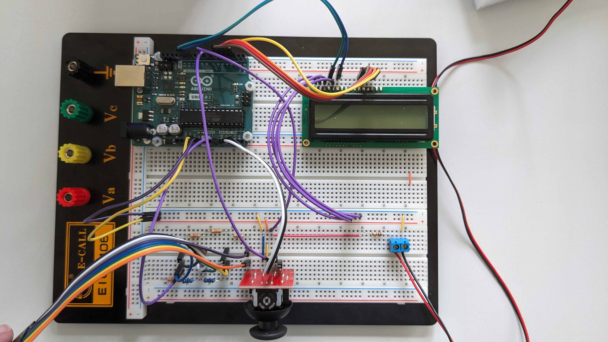
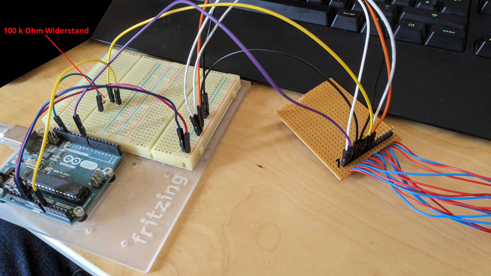

# Snake auf dem Arduino
**Autor:** Florian Königsmann (florian.koenigsmann@stud.htw-dresden.de)

**Beschreibung:** Ein Snake Spiel, welches mithilfe eines Arduinos auf einer Neopixel Matrix gespielt werden kann.

**Hinweis:** Sollte an dem Projekt weitergearbeitet werden, würde ich mich freuen, wenn dies in einem Fork des aktuellen Projektes entsteht, sodass dieses anschließend mittels Pull Request wieder in dieses Repository eingefügt werden kann. Über eine umfangreiche Dokumentation würde ich mich freuen. Für Fragen einfach eine E-Mail schreiben oder ein GitHub Issue erstellen.

## Spielablauf
Das Spiel wird gestartet, indem auf den Joystick von Spieler 1 gedrückt wird.

Die Schlange bewegt sich ab nun immer in Kopfrichtung (zu Beginn nach oben). Um die Richtung zu ändern,
kann mit dem Joystick nach links und rechts gelenkt werden (jeweils aus der Perspektive der Schlange).

Würde sich die Schlange außerhalb der Matrix bewegen oder in sich selbst fahren, ist das Spiel vorbei.
Das Spielfeld wird nun zurückgesetzt, indem auf den Joystick von Spieler 1 gedrückt wird. Bei erneutem
Druck startet das nächste Spiel.

In unregelmäßigen Abständen spawnt zufällig auf dem Spielfeld verteilt ein Item. Insgesamt kann es maximal
fünf Items geben. Wird das Item von der Schlange gefressen, so wird diese um einen Pixel Länger, und die Punktzahl
des Spielers erhöht sich. Alle fünf gefressene Items erhöht sich die Geschwindigkeit der Schlange ein wenig,
um das Spiel spannend zu erhalten.

## Hardware
* Arduino Uno Rev 3
* 16x2 [LCD HD44780](https://www.informatik.htw-dresden.de/~jvogt/mc/mc-lcd.html)
* Joystickmodul (+ analoger Joystick mittels [Gameport](https://de.wikipedia.org/wiki/Gameport))
* 16x16 Matrix [WS2812B](https://www.mikrocontroller.net/articles/WS2812_Ansteuerung) inklusive Spannungsversorgung mittels 50W Netzteil

In folgender Abbildung wird die vollständige Schaltung abgebildet. Das schwarz, rote Kabel mit dem blauen Stecker ist der Anschluss an die LED Matrix. Die Komponenten links des Joysticks (Widerstände sowie Jumper Kabel) dienen dem Anschluss des Keypads und werden aktuell nicht benötigt.


## Software
* Arduino IDE
* LCD Bibliothek [LiquidCrystal](https://www.arduino.cc/reference/en/libraries/liquidcrystal/)
* WS2812B Bibliothek [FastLed](https://fastled.io/)

## Programmierung
* Mittels C++, Objektorientierter Ansatz
* Aufteilung in folgende Klassen
  * Snake.ino (Hauptprogramm)
  * Item (von Schlange fressbares Spielitem, welches auf der Matrix angezeigt wird)
  * game_settings.h (Spieleinstellungen)
  * hardware_settings.h (Hardwarekonfiguration)
  * Matrix (verwalten der LED Matrix)
  * Player (Spieler, welcher seine Schlange steuert)
  * Snake (Schlange, welche auf der Matrix angezeigt wird "Spielfigur")
  * Statistics (Statistikverwaltung, die auf dem LCD angezeigt wird)

### game_settings
| Name | Bedeutung | Standardwert | Anmerkung
| --- | --- | --- | --- |
| PLAYERS | Anzahl der Spieler | 1 | :warning: Aktuell wird nur ein Spieler unterstützt, diese Definition hat damit keinerlei Wirkung
| MAX_ITEMS |  Maximale Anzahl der Items, die auf dem Spielfeld generiert werden können | 5 | -
| DEFAULT_ITEM_SPAWN_TICKS | Gibt an, aller wieviel Ticks ein Item standardmäßig generiert werden soll | 100 | :warning: Es handelt sich lediglich um den Standardwert, der tatsächliche Wert wird mittels einer Zufallsfunktion in Abhängigkeit vom Standardwert generiert, siehe [Itemgenerierung](#gameTick())
| BLINK_TICKS | Anzahl an Ticks, nach denen die Animation weiter fortschreitet | 10 | -

### hardware_settings
| Name | Bedeutung | Standardwert | Anmerkung
| --- | --- | --- | --- |
|LEDPIN | PIN, an dem die LED Matrix angeschlossen ist | 8 | -
|LEDCOUNT | Anzahl der LEDS in der Matrix | 256 | :warning: Aktuell werden nur quadratische Matrizen unterstützt (z.B. hier 16x16 -> 256)
|BUTTONPIN | Pin, an dem der Button angeschlossen ist, mit dem das Spiel gestartet bzw. neu gestartet werden kann | 7 | Im Normalfall wird der Joystick Knopf genommen, es kann aber auch ein anderer Knopf verwendet werden. Dann allerdings unbedingt prüfen, ob ein pullup Widerstand erforderlich ist!
|JOYSTICKX | Pin, an dem die X-Achse des Joysticks angeschlossen ist | A2 | Je nach verwendetem Joystick muss der Auslösebereich manuell eingestellt werden. Dafür gibt es bisher keine Einstellung, dies muss um Quellcode gemacht werden, siehe [Kommt noch](#todo)


### Snake.ino
* einbinden aller Bibliotheken
* LED Matrix, LCD, Spieler, Statistiken, Items (sowie dafür notwendige Parameter) initialisieren
* *ticksSinceLastItem*... Anzahl der Spielticks, die seit der Generierung des letzten Items vergangen sind.
* *nextItemTickCount*... Anzahl der Spielticks, die vergehen sollen, bis das nächste Item generiert wird.
* *ticksSinceLastAnimation*... Anzahl der Spielticks, die seit der letzten änderung der Animation vergangen sind. Dies wird benötigt, um die Blinkgeschwindigkeit der Schlange nach Spielende zu steuern.
* *gameState*... Aktueller Zustand des Spiels:
  * 0: Spiel läuft nicht, kann gestartet werden.
  * 1: Spiel wurde beendet, kann neu gestartet werden.
  * 2: Spiel läuft.
* *lastGameTick*... Zeitstempel (in ms) des letzten Spielticks
* *buttonPressed*... Wurde der Knopf gedrückt
  * Wird auf true gesetzt, sobald Knopf gedrückt wird.
  * Wird auf false gesetzt, sobald Knopf losgelassen wird.

#### setup()
* Serielle Schnitstelle öffnen mit Baudrate 9600 (nur für Debugging Zwecke)
* PIN des Knopfes als Eingang definieren (Pull Up Widerstand vermutlich bereits auf Joystick vorhanden, sonst wäre hier INPUT_PULLUP besser)
* Spielern Verweis auf Items (Array) übergeben
* Matrix zeichnen, Schlange nun erkennbar
* Standardwerte festlegen

#### loop()
Wird der Knopf losgelassen, wird der Eingang des Button LOW. Es wird sofort *buttonPressed* auf false gesetzt, um auf weitere Knopfeingaben reagieren zu können.
Das wird benötigt, da der Knopf aufgrund der Trägheit des Nutzes in der Regel mehrere loop Durchgänge gedrückt bleibt. Es soll verhindert werden, dass in diesem Fall das Spiel beispielsweise mehrfach zurückgesetzt wird oder direkt nach dem zurücksetzen startet. Jede Knopfabfrage, die dieses Feature benötigt, muss neben der digitalen Abfrage des Knopfzustandes auch noch prüfen, ob *buttonPressed* == false ist. 
```C++
if(!digitalRead(BUTTONPIN)) {
  buttonPressed = false;
}
```

Befindet sich das Spiel im Status 0, kann also gestartet werden, und der Knopf wurde gedrückt, wird *lastGameTick* auf die aktuelle Zeit zurückgesetzt, sowie der Spielstatus auf 2 gesetzt. Um mehrfache Eingaben zu verhindern, wird *buttonPressed* auf true gesetzt. Wie oben erläutert, dient dies dazu die Knopfeingabe zu "konsumieren", also für die weitere Verarbeitung zu sperren, bis der Knopf losgelassen wird.
```C++
if(gameState == 0 && digitalRead(BUTTONPIN) && !buttonPressed) {
  lastGameTick = millis();
  gameState = 2;
  buttonPressed = true;
}
```
Wird der Knopf im Spielzustand 1 gedrückt, wird der Spieler und die Statistik zurückgesetzt und angezeigt. Außerdem wird der Spielstatus auf 0 gesetzt, sodass das Spiel beim nächsten Knopfdruck gestartet werden kann.
Außerdem werden alle generierten Items gelöscht, indem das Array durchlaufen und für jedes Item *clear()* aufgerufen wird.
```C++
player.reset(); stats.reset(); stats.printPlayers();
gameState = 0;
for(int i = 0; i < MAX_ITEMS; i++) {
  items[i].clear();
}
```
Nun wird der X-Wert des Joysticks ausgelesen und zur Verarbeitung an die Player Funktion *handleJoystick(int joyStickX)* übergeben. Die Verarbeitung der Eingabe erfolgt nun in dieser Klasse.
```C++
int readX = analogRead(JOYSTICKX);
player.handleJoyStick(readX);
```
Damit das Spiel gleichmäßig läuft, wird es in Ticks unterteilt. Alle 50ms wird in der Hauptschleife ein Tick ausgelöst, in welchem für das Spiel relevante Berechnungen und Aktionen durchgeführt werden. Die Spielfunktionalität wird in der Funktion *gameTick()* untergebracht. Außerdem wird der Zeitstempel *lastGameTick* auf die aktuelle Zeit zurückgesetzt, da immer geprüft wird, ob die Differenz aus der aktuellen Zeit und diesem Zeistempel größer als 50 (ms) ist.
```C++
if(millis() - lastGameTick > 50) {
  lastGameTick = millis();
  gameTick();
}
```
#### gameTick()
In dieser Funktion werden alle Spielrelevanten Aktionen durchgeführt. Dazu zählen das erstellen von Items, sowie das Fortbewegen der Schlange. Es wird aber auch geprüft, ob der Spieler noch lebt und die entsprechende Statistik gespeichert und angezeigt.

Als erstes wird (falls nötig) das Item generiert. Dafür wird geprüft, ob mehr als *nextItemTickCount* Ticks vergangen sind. Ist dies nicht der Fall, wird kein Item erzeugt. Um zu verhindern, dass bei einem pausiertem Spiel Items generiert werden, wird *ticksSinceLastItem* in diesem Fall immer zurückgesetzt, sodass die Bedingung nicht wahr werden kann.
Tritt die Bedingung ein, wird *ticksSinceLastItem* ebenfalls zurückgesetzt, da ja nun versucht wird ein Item zu generieren. Nach der Funktion wird *ticksSinceLastItem* um eins inkrementiert, da ein weiterer Tick seit der letzten Item generierung vergangen ist.

Für die X, sowie Y Position wird ein zufälliger Wert im Intervall [0; 15] erstellt. Anschließend wird die Liste der Items durchlaufen. Für das Item an der aktuellen Position wird geprüft, ob es existiert und falls ja wird dieser Schleifendurchlauf übersprungen, da für ein bereits vorhandenes Item kein neues generiert werden soll. Existiert ein Item noch nicht, so wird versucht das Item an der randomisierten Position zu erstellen. Ist die Erstellung erfolgt, gibt die Funktion true zurück und die Schleife kann verlassen werden, da sowieso nur ein Item generiert werden soll. Konnte das Item nicht generiert werden, da es beispielsweise auf einer Schlange gespawnt wäre, wird es wieder entfern, um keinen Platz für nicht vorhandene Items zu verschwenden. Da alle weiteren Items auch an dieser Position erstellt werden würden, kann die Schleife auch in diesem Fall abgebrochen werden. Anschließend wird mittels Zufall bestimmt, in wie vielen Ticks das nächste Item genertiert werden soll. Dafür wird der Standardwert mit einem Wert zwischen 0,1 und 1,99 multipliziert.
```C++
byte randX = random(0, 16);
byte randY = random(0, 16);
for(int i = 0; i < MAX_ITEMS; i++) {
  if(items[i].exists()) continue;

  boolean allowedGeneration = items[i].generateItem(randX, randY, 0);

  if(!allowedGeneration) {
    items[i].remove();
  }
  break;
}
nextItemTickCount = DEFAULT_ITEM_SPAWN_TICKS * random(10, 200) / 100.0;
```

Anschließend wird im Fall eines laufenden Spiels der Spieler (bzw. seine Schlange) nach vorne bewegt. Abhängig von der Geschwindigkeit wird die Schlange nicht in jedem Tick weiter bewegt, genaueres dazu in der Klasse Snake. Die Funktion gibt zurück, ob die Schlange die Bewegung überlebt hat und speichert dies in die Variable *survived*. Anschließend wird die der Score des Spielers an die Statistik Klasse übergeben. Hat der Spieler nicht überlebt, wird dieser getötet (Hinweis: es wäre eventuell sinnvoller, dies automatisch in der Snake Klasse zu machen) und in der Statistik ebenfalls hinterlegt, dass der Spieler gestorben ist. Anschließend wird der Spielstatus auf 1 gesezt, da diese Runde mit dem Tod eines Spielers beendet ist. Anschließend wird die Statistik auf dem LCD ausgegeben.

```C++
if(gameState == 2) {
  bool survived = player.moveForward();

  stats.setPlayerScore(0, player.getScore());
  if(!survived) {
    player.die();
    stats.playerDead(0);
    gameState = 1;
  }
  stats.printPlayers();
}
```

Ist der Spieler gestorben, wird abschließend eine Blinkanimation abgespielt. Da diese mit der eigentlichen Tickrate viel zu schnell wäre, wird sie nur alle in *BLINK_TICKS* festgelegten Ticks ausgeführt. Dafür wird ebenfalls wieder gezählt, wie viele Ticks seit der letzten Animation vergangen sind bzw. die Tick Anzahl wird mit jedem Animationsschritt zurückgesetzt.
Die Methode *blink()* der Klasse Snake sorgt automatisch dafür, dass die richtigen Farben angezeigt werden.

```C++
if(player.dead() && ticksSinceLastAnimation > BLINK_TICKS) {
  ticksSinceLastAnimation = 0;
  player.blink();
}
ticksSinceLastAnimation++;
```
Anschließend werden alle in diesem Tick ausgeführten Spielveränderungen auf der LED MAtrix angezeigt.
```C++
m.show();
```

### Matrix
* Abstrahiert Hardware zu einer quadratischen RGB Matrix
* Speichert Farben aller Pixel in privatem Array (für jeden Pixel der Matrix ein Arrayeintrag mit Farbe)
* Stellt Funktion zum setzen einer Pixelfarbe bereit
* Stellt Funktion zum Anzeigen der aktuellen Farben auf der Matrix bereit
* In diesem Projekt
  * Keine reale Matrix mit Nummerierung (0; 0) ... (15; 15), sondern
  * WS2812B Neopixel, welche Schlangenförmig miteinander verbunden sind
  * Funktion nötig, welche Matrix Position in Neopixel Position umwandelt
  * Verwenden der FastLED Bibliothekt zur Ansteuerung der Neopixel
  * Initial sind alle Pixel aus (0x000000)

:warning: Die Stromversorgung reicht in diesem Fall **NICHT** aus, um alle drei Farben jedes Pixel in der vollen Helligkeit leuchten zu lassen, dies gilt es bei der verwendung zu berücksichtigen! Um das Problem zu umgehen wäre es denkbar, die maximale Helligkeit zu dimmen (z.B. jede Farbe darf maximal auf den Wert 155 gesetzt werden) und die zwischenliegenden Farben zu interpolieren.

| Variablenname | Typ | Beschreibung | Anmerkung |
| --- | --- | --- | --- |
| leds | CRGB[] | Speichert für jedes Pixel der Matrix die Farbe | Größe des Arrays wird mittels [LEDCOUNT](#hardware_settings) auf die maximal mögliche Anzahl der Pixel gesetzt |

#### setPixelColor()
Mithilfe dieser Funktion wird die Farbe eines Pixels an einer Koordinate gesetzt.

Die Funktion gibt true zurück, wenn die Pixelfarbe übernommen wurde, andernfalls false. Die Pixelfarbe kann nicht übernommen werden, wenn die x oder y Position außerhalb des zulässigen Wertebereiches liegen, oder die Farbe eines Pixels gesetzt werden soll, welcher bereits farbig ist.

| Parametername | Typ | Bedeutung | Anmerkung
| --- | --- | --- | --- |
| x | byte | x Position des Pixels auf der Matrix | Werteberich: 0 - 15
| y | byte | y Position des Pixels auf der Matrix | Werteberich: 0 - 15
| color | CRGB | Farbe, auf die der Pixel gesetzt werden soll | Typ aus der Bibliothek FastLED.h
| overwrite | bool | Gibt an, ob eine gesetzte Pixelfarbe (außer 0x000000) überschrieben werden darf | -

**Beispiel der Indexberechnung anhand einer 4x4 Matrix:** Auf der linken Seite ist die reale Nummerierung der Neopixel auf dem Streifen angegeben, die Nummern sind dabei im Programmcode die entsprechenden Indizes im Array. Rechts daneben sind die Koordinaten, wie sie für eine Matrix üblich sind und auf der ganz rechten Seite die Umrechnungsformel von Matrix Koordinaten in die entsprechenden Indizes.

 
| reale Nummerierung *n* | Matrix Koordinaten (x;y) | Formel |
| ------------------ | ------------------ | ------ |
| <table> <tr> <td>3</td> <td>2</td> <td>1</td> <td>0</td> </tr> <tr> <td>4</td> <td>5</td> <td>6</td> <td>7</td> </tr> <tr> <td>11</td> <td>10</td> <td>9</td> <td>8</td> </tr> <tr> <td>12</td> <td>13</td> <td>14</td> <td>15</td> </tr> </table> | <table> <tr> <td>(0;0)</td> <td>(1;0)</td> <td>(2;0);</td> <td>(3;0)</td> </tr> <tr> <td>(0;1)</td> <td>(1;1)</td> <td>(2;1);</td> <td>(3;1)</td> </tr> <tr> <td>(0;2)</td> <td>(1;2)</td> <td>(2;2);</td> <td>(3;2)</td> </tr> <tr> <td>(0;3)</td> <td>(1;3)</td> <td>(2;3);</td> <td>(3;3)</td> </tr> </table> | <table> <tr> <td>n = 4 * y + (3 - x)</td> </tr> <tr> <td>n = 4 * y + x</td> </tr> <tr> <td>n = 4 * y + (3 - x)</td> </tr> <tr> <td>n = 4 * y + x</td> </tr> </table>

Wie man in dem Beispiel sehen kann, gibt es lediglich 2 Formeln zur Umrechnung. Diese sind von der Nummer der Zeile (y Koordinate) abhängig und treten abwechselnd auf. Somit kann dies durch eine einfach Modulo Fallunterscheidung realisiert werden.

```C++
int arrayPos = 4 * y + x;
if(y % 2 == 0) {
  arrayPos = 4 * y + (3 - x);
}
```

 Die Berechnung für die 16x16 Matrix erfolgt nach demselben Konzept.

#### show()
Diese Funktion überträgt die aktuellen, im Array gespeicherten, Farben an die Neopixel, und zeigt diese an.

### Item
* Spielitem, welches von der Schlange gefressen werden kann
* Stellt Funktionen zum erstellen, entfernen sowie zur Kollissionsprüfung bereit
* Zeichnet Item direkt auf Matrix
* Mehrere Itemtypen können unterstützt werden :warning: Aktuell gibt es lediglich die Möglichkeit mehrere Typen festzulegen, allerdings ohne Funktionalität

| Variablenname | Typ | Beschreibung | Anmerkung |
| --- | --- | --- | --- |
| mDisplay | Matrix* | Zeiger auf die Matrix, auf welcher das Item angezeigt werden soll | - |
| mPosX | byte | x Position des Items | Wertebereich: 0 - 15, Initial 255 |
| mPosY | byte | y Position des Items | Wertebereich: 0 - 15, Initial 255 |
| mType | byte | Typ des Items | :warning: Noch ohne Nutzen |

:information_source: Mittels _mPosX_ = 255 kann ausgedrückt werden, dass das Item nicht im Spiel existiert. Dies kann beispielsweise genutzt werden, um ein Array mit Items anzulegen und diese erst später auf dem Spielfeld erscheinen zu lassen.

#### generateItem()
Mithilfe dieser Funktion lässt sich ein Item (eines bestimmen Typs) an einer bestimmen Position erzeugen.
Die Funktion gibt _true_ zurück, wenn das Item erstellt werden konnte, andernfalls _false_. Ein Item kann nicht generiert werden, wenn es sich mit einem anderen Item überlappt, oder auf einer Schlange entstehen würde.
Die Überprügung dieser Bedingung erfolgt aktuell über das direkte aufrufen von _setPixelColor()_, mit dem Parameter **_overwrite = false_**. Somit können nur Items auf leeren Feldern generiert werden.

| Parametername | Typ | Bedeutung | Anmerkung |
| --- | --- | --- | --- |
| x | byte | x Position des Items auf der Matrix | Werteberich gemäß _setPixelColor()_ der Matrix |
| y | byte | y Position des Items auf der Matrix | Werteberich gemäß _setPixelColor()_ der Matrix |
| type | byte | Typ des generierten Items | :warning: Ohne Funktion |

#### exists()
Mithilfe dieser Funktion kann geprüft werden, ob ein Item auf dem Spielfeld existiert (_true_), oder nur temporär angelegt wurde (_false_).

#### checkCollission()
Mithilfe dieser Funktion kann geprüft werden, ob für eine spezielle Koordinate eine Kollission mit diesem Item vorkommt. Da eine Kollission nur durch eine Schlange stattfinden kann welche das Item frisst wird _mPosX_ und _mPosY_ auf 255 zurückgesetzt. Das umfärben des Pixels auf der Matrix ist in dem Fall nicht nötig, da es durch die Schlange ohnehin überschrieben wird.
Tritt eine Kollission auf, wird _true_ zurückgegeben, andernfalls _false_.

| Parametername | Typ | Bedeutung | Anmerkung |
| --- | --- | --- | --- |
| x | byte | x Position des Items | - |
| y | byte | y Position des Items | - |

#### remove()
Mithilfe dieser Funktion kann das Item aus dem Spiel entfernt werden, **ohne** dabei von der Matrix gelöscht zu werden. Dies geschieht durch setzen von _mPosX_ und _mPosY_ auf 255. Um außerdem von der Matrix gelöscht zu werden, dient die Funktion _clear()_

:information_source: Ein aktueller Anwendungsfall für diese Funktion ist das entfernen eines Items, falls es auf einer Schlange oder einem anderen Item generiert wird, da in diesem Fall die Pixelfarbe nicht zurückgesetzt werden soll.

#### clear()
Mithilfe dieser Funktion kann das Item aus dem Spiel entfernt werden **und** wird dabei von der Matrix gelöscht.

### Snake
* Schlange, die sich durch das Spielfeld bewegt
* Schlange stirbt bei Kollission mit sich selbst oder dem Rand
* Beim fressen eines Item gibt es verschieden Effekte:
  * Schlange wird ein Feld länger
* Mit zunehmender Länge wird die Schlange schneller

| Variablenname | Typ | Beschreibung | Anmerkung |
| --- | --- | --- | --- |
| mDisplay | Matrix* | Zeiger auf die Matrix, auf welcher die Schlange angezeigt werden soll | - |
| mColor | CRGB | Farbe der Schlange | Typ aus der Bibliothek FastLED.h
| mDirection | byte | Richtung, in welche sich die Schlange aktuell bewegt | <table> <tr> <th> Richtung </th> <th> Numerische Repräsentation </th> </tr> <tr> <td>Hoch</td> <td>0</td> </tr> <tr> <td>Rechts</td> <td>1</td> </tr> <tr> <td>Runter</td> <td>2</td> </tr> <tr> <td>Links</td> <td>3</td> </tr> </table> |
| mStartX | byte | x Koordinate der Startposition | Wertebereich: 0 - 15 |
| mStartY | byte | y Koordinate der Startposition | Wertebereich: 0 - 15 |
| mDead | bool | Gibt an, ob die Schlange tot ist | - |
| mBlinkColor | bool | True, wenn aktuell die Schlange die Farbe haben soll, wenn sie blinkt, false falls es die Standardfarbe sein soll | - |
| mStartLength | int | Startlänge der Schlange | - |
| mLength | int | Aktuelle Länge der Schlange |
| mSnakePartsX | byte[] | Speichert die x Koordinaten aller Pixel der Schlange | Größe des Arrays wird mittels [LEDCOUNT](#hardware_settings) auf die maximal mögliche Anzahl der Pixel gesetzt |
| mSnakePartsY | byte[] | Speichert die y Koordinaten aller Pixel der Schlange | Größe des Arrays wird mittels [LEDCOUNT](#hardware_settings) auf die maximal mögliche Anzahl der Pixel gesetzt |
| ticksSinceLastMove | int | Anzahl der Ticks, die seit der letzten Bewegung vergangen sind | - |
| gameItems | Item* | Zeiger auf Array aller Items, welche auf dem Spielfeld erscheinen können | Eventuell andere Realisierung prüfen, es wirkt unsinnig die Items an die Schlange zu übergeben |

#### reset()
Mithilfe dieser Funktion werden alle farbigen Pixel der Schlange zurückgesetzt auf aus (0x000000), sowie alle Variablen auf ihre Standardwerte gesetzt. Anschließend wird die Schlange an ihrer Startposition gezeichnet.

Da die Schlange vertikal gezeichnet werden, wird beim einfärben der Pixel immer derselbe x Wert (_mStartX_) verwendet und nur der y Wert mit _mStartY_ beginnend _mLength_ mal inkrementiert.
 ```C++
for(int i = 0; i < mLength; i++) {
  mSnakePartsX[i] = mStartX;
  mSnakePartsY[i] = mStartY + i;
  mDisplay->setPixelColor(mSnakePartsX[i], mSnakePartsY[i], mColor, true);
}
 ```

#### die()
Setzt die Variable _mDead_ auf _true_, um die Schlange als tot zu deklarieren.

#### dead()
Gibt _true_ zurück, falls die Schlange tot ist, andernfalls _false_.

#### blink()
Diese Funktion steuert das Blinkverhalten der Schlange. Beim aufrufen wird die komplette Schlange alternierend in ihrer normalen Farbe und der Blinkfarbe (0xFF0000) gezeichnet.

#### initItems()
Mithilfe dieser Funktion wird dem Objekt das initialisierte Item Array übergeben.

#### moveForward()
Mit dem aufrufen dieser Funktion bewegt sich die Schlange einen Schritt vorwärts und führt dabei alle spielrelevanten Überprüfungen aus. Hier wird außerdem die Geschwindigkeit der Schlange gesteuert, indem sie sich nicht mit jedem Tick weiter bewegt, sondern in einem Tickintervall in Abhängigkeit ihrer Länge. hat die Schlange diesen Spielzug überlebt, gibt die Funktion _true_ zurück, andernfalls _false_.

| Variablenname | Typ | Beschreibung | Anmerkung |
| --- | --- | --- | --- |
| moved | bool* | Die Funktion schreibt _true_ in die Pointer Variable, wenn sich die Schlange bewegt hat, andernfalls _false_. | Der boolean muss beim Aufrufer angelegt und als Pointer übergeben werden |

Im folgenden Abschnitt wird die Geschwindigkeit der Schlange in Abhängigkeit von ihrer **gewachsenen Länge** (_mLength_ - _mStartLength_) geregelt. Die Abklingzeit zwischen den Schritten verringert sich alle 5 Schlangenverlängerungen um einen Tick.
Dafür wird für jeden Schritt der Counter _ticksSinceLastMove_ erhöht.Überschreitet dieser den an die Länge angepassten Schwellenwert, so wird der Counter zurückgesetzt und die Schlange bewegt sich einen Pixel weiter. Beispielsweise hat die Schlange direkt nach dem Start ein Delay von 10 Ticks, da die davon abgezogene **gewachsene Länge** durch 5 geteilt gleich 0 ist. Da die Nachkommastellen abgeschnitten werden, ist beispielsweise für eine **gewachsene Länge** von 4 der abgezogene Term 4/5 weiterhin gleich 0. Erst ab der nächsten Stufe ist dieser Bruch gleich 1 und das Timeout damit nurnoch 9 Ticks.

Erfolgt kein Schritt, so wird die Pointervariable _moved_ auf _false_ gesetzt, um der Aufruferfunktion (wenn nötig) mitzuteilen, dass die Bewegung noch nicht verarbeitet wurde, andernfalls wird sie auf _true_ gesetzt. Außerdem wird sofort _true_ zurückgegeben, da die Schlange ohne einer Bewegung auch nicht sterben kann.

```C++
if(ticksSinceLastMove < 10 - (mLength - mStartLength) / 5) {
  ticksSinceLastMove++;
  *moved = false;
  return true;
}
ticksSinceLastMove = 0;
*moved = true;
```

Anschließend wird in Abhängigkeit von der aktuellen Richtung _mDirection_ die neue Kopfposition (_newHeadX_; _newHeadY_) berechnet. Folgende Tabelle zeigt, wie die neuen Positionen in Abhängigkeit von der alten Kopfposition (_mSnakePartsX[0]_; _mSnakePartsY[0]_) zustande kommen:

| Bewegungsrichtung (_mDirection_)| Neuer x Wert _newHeadX_ | Neuer Y Wert _newHeadY_ | Erklärung |
| --- | --- | --- | --- |
| oben (_UP_, 0) | gleich | _mSnakePartsY[0]_ - 1 | Verschiebung nur auf y Achse, oben sind y Werte kleiner |
| rechts (_RIGHT_, 1) | _mSnakePartsX[0]_ + 1 | gleich | Verschiebung nur auf x Achse, rechts sind x Werte größer |
| unten (_DOWN_, 2) | gleich | _mSnakePartsY[0]_ + 1 | Verschiebung nur auf y Achse, unten sind y Werte größer |
| links (_LEFT_, 3) | _mSnakePartsX[0]_ - 1 | gleich | Verschiebung nur auf x Achse, links sind x Werte kleiner |

Ist die x oder y Koordinate des Kopfes außerhalb des Spielfeldes, also kleiner 0 oder größer 15, so stirbt die Schlange und es wird _false_ zurückgegeben.

Anschließend wird geprüft, ob es durch die Bewegung eine Kollission mit einem Item gab. Dafür wird das Item Array durchlaufen und für jedes Item geprüft ob es auf dem Spielfeld existiert und eine Kollission vorliegt. Gibt es eine Kollission, so wird die Schleife verlassen, da keine weitere Kollission möglich ist (es kann ja immer nur ein Item an einer Stelle geben). Anschließend wird der Pixels des Schwanzendes der Schlange deaktiviert, da sie sich ja weiter bewegen soll. Wurde allerdings ein Item gefressen (_gotItem_ = _true_), welches die Schlange verlängert kann dies einfach realisiert werden indem dieser letzte Pixel niht deaktiviert wird. Dies geschieht im unte gezeigten Snippet.

```C++
if(!gotItem) {
  mDisplay->setPixelColor(mSnakePartsX[mLength - 1], mSnakePartsY[mLength - 1], 0x000000, true);
}
```

Nun wird die Bewegung der Schlange in die Arrays _mSnakePartsX_ und _mSnakePartsY_ übertragen. Dafür rückt jedes Element, beginnend mit dem vorletzten einen Index nach hinten d.h. der vorletzte Wert rückt an die Stelle des letzten, die des vorvorletzten and die des vorletzten und so weiter. Der Index 0, also die Kopfposition wird später durch die neuen Kopfkoordinaten _newHeadX_ und _newHeadY_ ersetzt.

Außerdem wird geprüft, ob die Schlange sich selbst frisst. Tritt eine Kollission auf, so stirbt die Schlange und es wird _false_ zurückgegeben.
Andernfalls hat die Schlange den Spielzug überlebt undd es wird _true_ zurückgegeben.

#### checkCollission()
Mithilfe dieser Methode wird überprüft, ob der Schlangenkopf mit sich selbst kollidiert. Gibt es eine überschneidung, wird _true_ zurückgegeben, sonst _false_. Dafür werden alle Pixel der Schlange durchlaufen und geprüft, ob eines dieser Pixel die gleiche Koordinate wie der Kopf hat. 

| Parametername | Typ | Bedeutung | Anmerkung |
| --- | --- | --- | --- |
| x | byte | x Position des Schlangenkopfes | - |
| y | byte | y Position des Schlangenkopfes | - |

#### turnRight()
Diese Methode ändert die Richtung der Schlange im Uhrzeigersinn. Ist die Richtung der Schlange beispielsweise oben, zeigt sie anschließend nach rechts usw.
Dazu wird die Richtugnsvariable _mDirection_ einfach erhöht. Bei einer Drehung aus der Richtung links (_LEFT_, 3) nach rechts müsste oben (_UP_, 0) folgen, durch die Inkrementierung wäre der Wert der Variable allerdings 4, deshalb wird sie wieder auf 0 (_UP_) gesetzt. 

#### turnLeft()
Diese Methode ändert die Richtung der Schlange gegen den Uhrzeigersinn. Ist die Richtung der Schlange beispielsweise oben, zeigt sie anschließend nach links usw.
Dazu wird die Richtugnsvariable _mDirection_ einfach verringert. Bei einer Drehung aus der Richtung oben (_LEFT_, 3) nach links müsste links (_LEFT_, 3) folgen, durch die Dekrementierung wäre der Wert der Variable allerdings 255** deshalb wird sie wieder auf 3 (_LEFT_) gesetzt.

** :warning: Da der Typ byte vorzeichenlos ist, wird aus der -1 eine 255, welche damit größer 3 ist!

### Player
* Spieler, welcher genau einer Schlange zugeordnet ist
  * von Snake Klasse abgeleitet
* beinhaltet Steuerung der Schlange mittels Joystick

| Variablenname | Typ | Beschreibung | Anmerkung |
| --- | --- | --- | --- |
| mAllowNextDirection | bool | _True_, wenn der Spieler die nächste Eingabe machen kann, da die letzte Eingabe ausgeführt wurde, sonst _false_ | Verhindert, dass ein Spieler in einem Schritt mehrere Richtungsänderungen durchführen kann |
| mJoyStickXDefaultPosition | bool | _True_, sobald der Joystick einmal seine Ausgangslage bezüglich der x - Achse erreicht hat, sonst _false_ | Vermeidet, dass durch zu langes halten des Joysticks mehrere Richtungswechsel durchgeführt werden. |

#### handleJoyStick()
Mithilfe dieser Funktion wird der Joystick ausgelesen und verarbeitet.

| Parametername | Typ | Bedeutung | Anmerkung |
| --- | --- | --- | --- |
| joyStickX | int | Messwert der X Achse des Joysticks | - |

Wenn der ausgelesene Wert des Joysticks kleiner 350 ist, wurde der Joystick nach links bewegt und die Schlange dreht sich nach links. Ist der Wert > 650, so führt sie eine Rechtsdrehung durch.

Nachdem eine Richtungsänderung registriert wurde, wird die Richtungsänderung (_mAllowNextDirection_) solange gesperrt, bis sich die Schlange durch _moveForward()_ weiter bewegt hat. Wie oben genannt soll dies verhindern, dass ein Spieler innerhalb eines Schrittes nicht mehrere Richtungveränderungen durchführen kann, da sich die Schlange sonst beispielsweise rückwärts bewegen müsste (zweimal rechts oder links).
Außerdem wird die _mJoyStickDefaultPosition_ auf _false_ gesetzt, da der Joystick vor jeder neuen Aktion einmal in der Mitte positioniert werden muss. Dadurch wird verhindert, dass ein zu langes halten des Joysticks in einer Richtung zu ungewollten mehrfachen Richtungsänderungen führt. Dies ist insbesondere in schnellen Leveln ein Problem, wenn die Schlange so schnell ist, dass selbst ein kurzes halten des Joysticks in einer Richtung zu mehreren, unkontrollierten Drehungen der Schlange führt und sich das Spiel dadurch träge anfühlt. Diese Variable wird zurückgesetzt, sobald der Wert des Joysticks in einem Bereich zwischen 350 und 650 befindet.

#### moveForward()
Diese Funktion ermöglicht das freigeben der nächsten Bewegung, nachdem ein Schritt der Schlange ausgeführt wurde. Mithilfe der _hasMoved_ Variable wird ausgewertet, ob die Schlange sich in diesem Tick bewegt hat, oder nicht. Hat sie sich bewegt, so wird _mAllowNextDirection_ auf _true_ gesetzt, um die nächste Richtungseingabe zu erlauben.
Da diese Funktion eine Überschreibung der von der Snake Klasse vererbten Funktion _moveForward()_ ist, gibt auch diese zurück, ob der Spieler noch lebt, oder nicht. 
### Statistics
* Statistiken, die auf einem LCD angezeigt werden können
* Anzeigen von Spielername (aktuell nur Spieler 1) und dessen Punktahl
* Anzeigen, wenn Spieler gestorben ist

| Variablenname | Typ | Beschreibung | Anmerkung |
| --- | --- | --- | --- |
| mDisplay | LiquidCristal* | Zeiger auf LCD Display, welches die Infos anzeigen soll | Typ aus der Bibliothek LiquidCrystal.h |
| playerScores | int[] | Speichert die Scores der einzelnen Spieler | Größe des Arrays wird mittels [PLAYERS](#game_settings) auf die aktuelle Spieleranzahl angepasst |
| playersDead | bool[] | Speichert für jeden Spieler, ob dieser gestorben ist | Größe des Arrays wird mittels [PLAYERS](#game_settings) auf die aktuelle Spieleranzahl angepasst |

:information_source: Die Konfiguration der Zeilen und Spaltenanzahl des LCD findet aktuell noch im Konstruktor statt.

#### printPlayers()
Mithilfe dieser Funktion werden alle Spieler, sowie deren Score auf das LCD ausgegeben. Ist ein Spieler gestorben, wird des weiteren ein _X_ ausgegeben.

:warning: Da das Display nur 2 Zeilen hat, können aktuell nicht mehr als 2 Spieler angezeigt werden!

#### setPlayerScore()
Mithilfe dieser Funktion kann der Score eines Spielers gesetzt werden.

| Parametername | Typ | Bedeutung | Anmerkung |
| --- | --- | --- | --- |
| playerId | byte | Id des Spielers | :warning: Aktuell wird nicht geprüft, ob die _playerId_ zulässig ist |
| score | int | der Score des Spielers | - |

#### playerDead()
Mithilfe dieser Funktion kann für einen Spielers gesetzt werden, dass dieser verloren hat.

| Parametername | Typ | Bedeutung | Anmerkung |
| --- | --- | --- | --- |
| playerId | byte | Id des Spielers | :warning: Aktuell wird nicht geprüft, ob die _playerId_ zulässig ist |

#### reset()
Mithilfe dieser Funktion werden die Statistiken zurückgesetzt.

## Todo
* Multiplayer
  * Vorraussetzung durch OOP bereits gelegt, lediglich Kollissionsprüfung der Schlangen noch nicht implementiert
* Auswahl der Farbe der Schlange mittels Keypad
  * Hexadezimale Eingabe, Anzeige auf dem LCD oder Live auf der Matrix
* Steuerung mit analogem Joystick
  * Widerstand für Spannungsteiler der X bzw. Y Achse: 100k Ohm, 10k Ohm sind deutlich zu wenig
  * :warning: Die Nummerierung (des ersten und letzten Pins) sind beim verkleinern der Leiterplatte unleserlich geworden, es sollte eine bessere Kennzeichnung erfolgen. Pin 1 liegt auf der Seite, an der **kein** Anschlusspin der Pinfahne übrig ist (schwarze "1" auf der Abbildung). Folgende Abbildung zeigt den Beispielhaften Anschluss der Taste 1 (Pin 2, violetter Jumper) und der y Achse des Joysticks (Pin 6, gelber Jumper).
  * :information_source: Ich selber habe noch nicht viel mit dem Joystick experimentiert, lediglich die Tasten sowie die x bzw. y Achse ausgelesen. Das auslesen der Tasten hat allerdings nicht wirklich gut funktioniert und ich weiß auch nicht, ob alle Anschlüsse (Masse und 5V) benötigt werden Die entsprechende Experimentierarbeit überlasse ich dem Nachfolger dieses Projektes ;)
  
* Überarbeitung des vorhandenen Codes, Optimierungen
  * Speicherplatz optimieren
  * Position Klasse / struct, die Koordinaten verwaltet
  * Ansteuerung von nicht quadratischen Matrix
  * Ersetzen von einigen unsauberen Funktionen (z.B. konkrete Werte in der Berechnung der Matrixposition, Itemgenerierung)
* Statistiken ordentlich machen
  * Leaderboard anzeigen
  * Custom Namen
  * eventuell Mehr als 2 Spieler anzeigen
* Mehr Items
  * Stern, der unsterblich macht
  * Giftitem, welches man nicht fressen sollte bzw. generell Hindernisse
* Zusätzliche Spielmodi
  * keine Außenränder